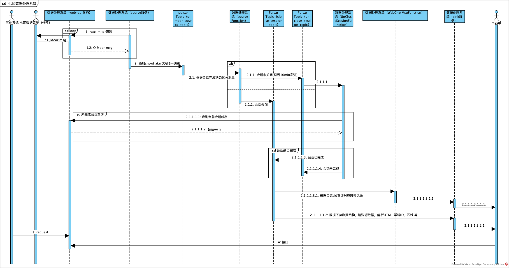

# Pulsar IO QiMoor
## 整个七陌数据服务时序图



* * *


# 7moor Pulsar-web-api
- 功能描述
- [x] 将七陌接口封装起来且提供便于子系统查询的接口
- [x] 给CRM提供访问本地会话、聊天记录接口
- [x] 使用guava的rateLimiter方式进行接口限流

* * *
## 注意：localrun方式为本地启动，create方式为后台创建实例并启动
## 7moor Pulsar Source 
- 功能描述: 
- [x] 请求web-api服务，获取七陌会话信息
- [x] 使用Bookkeeper的state保存读取七陌会话的NextOffset
- [x] 将接收到的数据存入**qimoor-source-topic**中

> 启动脚本
``` java 
$ ./bin/pulsar-admin source create --source-config-file connectors/source/qimoor-source.yml
```

> qimoor-source.yml 
``` yaml
tenant: "public"
namespace: "default"
name: "pulsar-qimoor-source"
topicName: "pulsar-io-sevenmoor"
archive: "connectors/source/pulsar-io-qimoor-1.0.0-SNAPSHOT.nar"
parallelism: 1
configs:
  pulsar.service.url: "pulsar://127.0.0.1:6650"
  snowflake-cluster-id: 0
  snowflake-worker-id: 0
  api-adapter-url: "http://docker.for.mac.host.internal:8081"
  collect-qimoor: "BXG"
  qimoor-source-topic-name: "qimoor-source-topic"
  offset-begin-time: "2020-10-01 00:00:00"
  offset-state-key: "PAST_WEB_CHAT_COLLECT"
  time-difference: "0"
  is-open-time-diff: false
```

* * *

## 7moor Pulsar Function
#### 7moor SourceFunction
- 功能描述：
- [x] 订阅**qimoor-source-topic**
- [x] 数据清洗（UTM相关、学科相关、地域相关等），得到完成会话、未完成会话，分别存入**close-session-topic**（已完成会话）、**un-close-session-topic**（未完成会话采用延迟方式）

> 启动脚本
``` java
$ ./bin/pulsar-admin functions create --function-config-file connectors/function/qimoor-source-function.yml --user-config '{
"snowflake-cluster-id": "0",
"snowflake-worker-id": "0",
"un-close-session-topic-name": "un-close-session-topic",
"close-session-topic-name": "close-session-topic",
"table-name": "d_bxg_dvb.web_chat_session",
"jdbc-url": "jdbc:mysql://am-bp1kl330q98skjot8131910o.ads.aliyuncs.com/d_bxg_crm",
"user-name": "bxg_test",
"password": "82#eyB4!JGKP(*&V5UD",
"course-types": "promote,class,freecourse,course,live"
}'
```
> qimoor-source-function.yml
``` yaml
tenant: "public"
namespace: "default"
name: "qimoorSourceFunction"
jar: "connectors/function/pulsar-io-qimoor-1.0.0-SNAPSHOT.jar"
inputs: ["persistent://public/default/qimoor-source-topic"]
className: "com.boxuegu.basis.pulsar.qimoor.function.QiMoorSourceFunction"
```

* * *

#### 7moor UncloseSessionFunction
- 功能描述
- [x] 订阅**un-close-session-topic**
- [x] 解析数据，得到会话的完成状态，如果当前会话为已完成会话，则存入**close-session-topic**中，反之当前会话为未完成状态，调用**web-api**服务，查询当前的会话完成状态，仍为未完成状态，则**延迟**存入**un-close-session-topic**中，反之存入**close-session-topic**

> 启动脚本
``` java 
$ ./bin/pulsar-admin functions create --function-config-file connectors/function/unCloseSessionFunction.yml  --user-config '{
"snowflake-cluster-id":"0",
"snowflake-worker-id":"0",
"un-close-session-topic-name":"un-close-session-topic",
"close-session-topic-name":"close-session-topic",
"table-name":"d_bxg_dvb.web_chat_session",
"api-adapter-url"="http://docker.for.mac.host.internal:8081",
"jdbc-url":"jdbc:mysql://am-bp1kl330q98skjot8131910o.ads.aliyuncs.com/d_bxg_dvb",
"user-name":"bxg_test",
"password":"82#eyB4!JGKP(*&V5UD",
"max-retry-times":"4",
"retry-time":"2000",
"collect-qimoor":"BXG"
}'
```
> unCloseSessionFunction.yml
``` yaml
tenant: "public"
namespace: "default"
name: "unCloseSessionFunction"
jar: "connectors/function/pulsar-io-qimoor-1.0.0-SNAPSHOT.jar"
inputs: ["persistent://public/default/un-close-session-topic"]
className: "com.boxuegu.basis.pulsar.qimoor.function.UnCloseSessionFunction"
```

* * *

#### 7moor WebChatMsgFunction
- 功能描述
- [x] 订阅**close-session-topic**
- [x] 解析数据，根据**sid**调用**web-api**服务，获取当前会话下的所有聊天记录，存入**web-chat-msg-topic**

> 启动脚本
``` java
$ ./bin/pulsar-admin functions create --function-config-file connectors/function/webChatMsgFunction.yml  --user-config '{
"snowflake-cluster-id":"0",
"snowflake-worker-id":"0",
"web-chat-msg-topic-name":"web-chat-msg-topic",
"table-name":"d_bxg_dvb.web_chat_message",
"max-retry-times":"4",
"retry-time":"2000",
"collect-qimoor":"BXG",
"api-adapter-url":"http://docker.for.mac.host.internal:8081"
}'
```

> webChatMsgFunction.yml
``` yaml
tenant: "public"
namespace: "default"
name: "webChatMsgFunction"
jar: "connectors/function/pulsar-io-qimoor-1.0.0-SNAPSHOT.jar"
inputs: ["persistent://public/default/close-session-topic"]
className: "com.boxuegu.basis.pulsar.qimoor.function.WebChatMsgFunction"
```
* * *
## 7moor Pulsar Sink 
- 功能描述
- [x] 同时订阅**close-session-topic**和**web-chat-msg-topic**
- [x] 解析数据，同步到mysql


----
## 停止服务

> Source 服务停止脚本为 
``` java
./bin/pulsar-admin sources stop --name pulsar-qimoor-source
```
> Source 服务删除脚本为
``` java
./bin/pulsar-admin sources delete --name pulsar-qimoor-source
```
> Function 服务停止脚本为 
``` java
./bin/pulsar-admin functions stop --name webChatMsgFunction
```
> Function 服务删除脚本为
``` java
./bin/pulsar-admin functions delete --name webChatMsgFunction
```
> Sink 服务停止脚本为 
``` java
./bin/pulsar-admin sinks stop --name local-jdbc-sink
```
> Sink 服务删除脚本为
``` java
./bin/pulsar-admin sinks delete --name local-jdbc-sink
```

----
## References:
> https://pulsar.apache.org/ (Pulsar 官方文档)
> https://pulsar.apache.org/docs/en/functions-overview/ (关于Pulsar Function相关)

